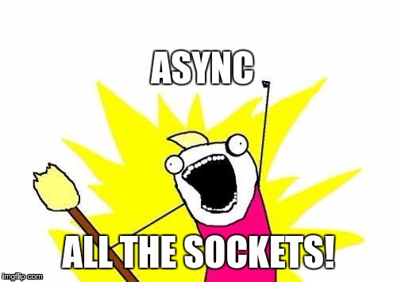

# asyncats



This repository contains my exercise codes of asynchronous socket programming in
different programming languages, especially using some built-in features (e.g.
from standard library) for asynchronicity instead of third-party packages.

**Notice:** Socket API is not overwhelmingly supported in every programming
language's standard library, hence some of the code will share a totally
different style to implement an asynchronous echo server.

## Example

Each piece of code will share the same interaction, and listen to localhost on
port 8080 for echoing simple message. For instance, the client side:

```bash
$ nc localhost 8080
foo
foo
bar
bar
```

The server will returns the actual message you just send. On the server side:

```
Available on localhost:8080
Connection from ('127.0.0.1', 36440)
('127.0.0.1', 36440) disconnected
```

## Installation

## Usage

## License

CC0 1.0 - Public domain, just some itsy bitsy exercise code.
